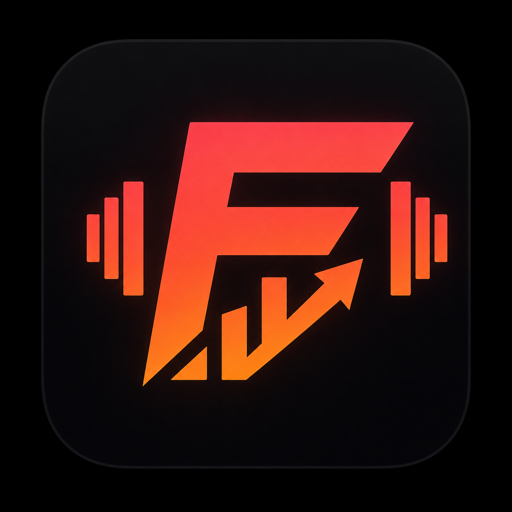

<p align="center">
  
</p>

<p align="center">
  <a href="https://formly.vercel.app"><strong>Открыть Formly</strong></a>
  ·
  <a href="changelog.md">История изменений</a>
</p>

<p align="center">
  <a href="https://github.com/princeofscale/Formly/actions/workflows/ci.yml"></a>
  
  
  
  
</p>

## О проекте

Formly — мобильный фитнес-трекер для ведения тренировок, анализа прогресса и персональных AI-рекомендаций. Приложение работает как PWA, сохраняет активную тренировку офлайн и синхронизирует данные через Supabase.

<p align="center">
  
</p>

## Возможности

- Ведение силовых и кардио-тренировок: подходы, вес, повторы, RPE и таймер отдыха.
- История, объём, 1RM, рекорды, серии тренировок и прогресс по упражнениям.
- Шаблоны, готовые программы, разминка и подсказки по прогрессии.
- AI-разбор тренировок и рекомендации на базе Mistral AI.
- Каталог упражнений с русскими названиями, алиасами и fuzzy-поиском.
- Офлайн-режим, PWA-установка и push-уведомления.
- Русский и английский интерфейс, адаптированный под телефон.

## Стек

| Область       | Технологии                                                 |
| ------------- | ---------------------------------------------------------- |
| Web           | Next.js 16, React 19, TypeScript, Tailwind CSS 4           |
| Backend       | Supabase, PostgreSQL, Row Level Security                   |
| AI            | Mistral AI                                                 |
| UX            | PWA, next-intl, Recharts, shadcn/ui                        |
| Наблюдаемость | Vercel Analytics, Speed Insights, client error reports     |
| Качество      | Vitest, ESLint, Prettier, Knip, ts-prune, CodeQL, gitleaks |

## Локальный запуск

Требуется Node.js 24 и npm.

```bash
git clone https://github.com/princeofscale/Formly.git
cd Formly
npm install
cp .env.local.example .env.local
npm run dev
```

Приложение откроется на `http://localhost:3000`.

Минимальные переменные окружения:

```dotenv
NEXT_PUBLIC_SUPABASE_URL=
NEXT_PUBLIC_SUPABASE_ANON_KEY=
SUPABASE_SERVICE_ROLE_KEY=
MISTRAL_API_KEY=
```

Push-уведомления дополнительно используют `NEXT_PUBLIC_VAPID_PUBLIC_KEY`, `VAPID_PRIVATE_KEY` и `VAPID_CONTACT_EMAIL`. Полный шаблон находится в `.env.local.example`.

## Команды

```bash
npm run dev          # локальная разработка
npm run test         # тесты
npm run lint         # ESLint
npm run typecheck    # TypeScript
npm run format:check # проверка форматирования
npm run build        # production-сборка
```

Перед отправкой изменений рекомендуется выполнить `npm run lint && npm run typecheck && npm run test && npm run build`.

## База данных

SQL-миграции находятся в `supabase/migrations`. Применение через Supabase CLI:

```bash
supabase db push
```

Никогда не добавляйте секретные ключи в Git. Все env-файлы игнорируются.

## Релизы и деплой

- Каждый push в `main` проверяется CI и деплоится интеграцией Vercel с GitHub.
- Тег вида `v1.2.3` запускает отдельный production-деплой через `.github/workflows/release.yml`.
- Все изменения сначала добавляются в раздел `Unreleased` файла [changelog.md](changelog.md), а при релизе переносятся в версию.

Production: [formly.vercel.app](https://formly.vercel.app)
